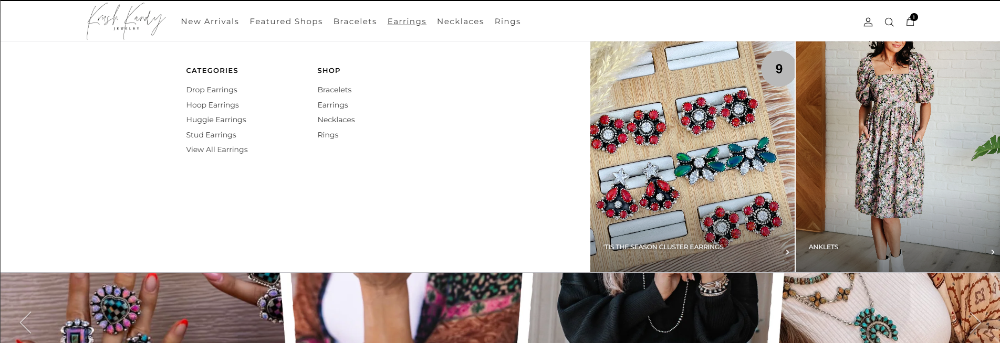
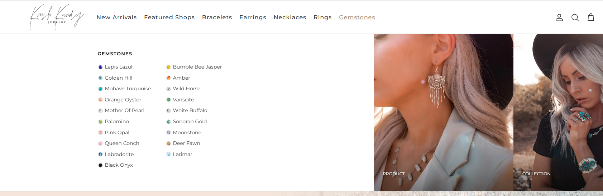

# Mega Menu Header (Shopify UI Component)

A customizable Mega Menu Header component for Shopify themes with dropdown support and responsive design.

## 🚀 Features

- 🔹 Multi-level dropdown mega menu
- 🔹 Fully responsive design
- 🔹 Easy integration with any Shopify theme
- 🔹 Clean and customizable structure

## 📦 Included

- Mega Menu Header (.liquid)
- Supporting CSS
- JavaScript for interactions

## 🛠️ How to Use

1. Copy the component files (`.liquid`, `.css`, `.js`) into your Shopify theme.
2. Include the header section in your theme layout.
3. Customize menu items via Shopify Navigation or code.

## 💡 Use Case

Ideal for:
- Stores with large product catalogs
- Custom Shopify theme development
- Improving navigation UX

## 📸 Screenshots

## 📄 License

Open-source for personal and commercial use.
