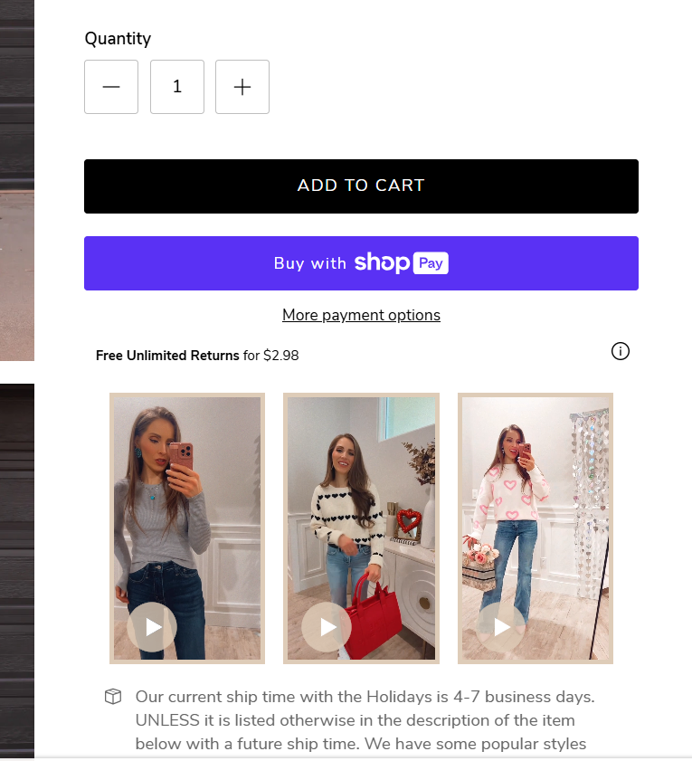
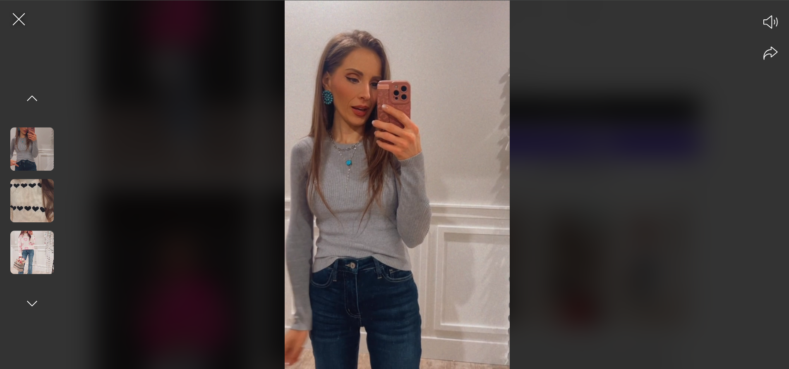

# Video Modal (Shopify UI Component)

A flexible Video Modal component for Shopify that supports YouTube and MP4 videos.

## 🚀 Features

- 🔹 Supports YouTube and self-hosted MP4 videos
- 🔹 Smooth modal popup
- 🔹 Fully responsive
- 🔹 Lightweight and easy to integrate

## 📦 Included

- Video Modal Section (.liquid)
- CSS for styling
- JavaScript for modal functionality

## 🛠️ How to Use

1. Copy the component files (`.liquid`, `.css`, `.js`) into your Shopify theme.
2. Add the section where you want the video modal.
3. Configure video source (YouTube link or MP4) in the Shopify editor.

## 💡 Use Case

Ideal for:
- Product showcase videos
- Promotional content
- Landing pages

## 📸 Screenshots (Optional)

## 📄 License

Open-source for personal and commercial use.